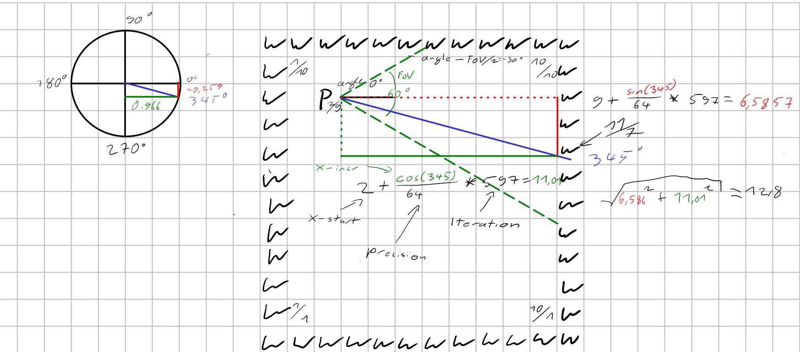

[Highres_highrefresh.webm](https://github.com/lennartbrandin/terminal-raycasting/assets/92579517/9bec83b6-1a21-45bf-bcb7-3e4af6dd9678)

# Konzept & Einteilung
Die grundlegende Idee ist, ein 2D Array, basierend auf einer Position im Raum, auf dem Terminal als "3D" Render darzustellen.
Hierzu kann man dies in 3 Schritte aufteilen:
- Eingabe Verarbeitung (Marc)
- Raycasting (Lennart)
- Terminal gerenderte visuelle Darstellung (Piet)


## Raycasting
Raycasting beschreibt den Renderprozess, hier gibt es folgenden Überlegungen:
- Was sieht man ([Sichtfeld](#Sichtfeld))
- Wie weit ein Objekt entfernt ist ([Objektgröße](#Objektgröße))

{height=300px}

### Sichtfeld
Zur Überlegung, was alles im Sichtfeld liegt, werden einzelne "Rays" vom Spieler aus in das Sichtfeld geschickt.
- Rays und die Spieler Position sind Vektoren.
- Ein Spieler besitzt ein Sichtfeld (FoV) das mithilfe des Kamera Winkels ausgerichtet wird
- Ausgangsrichtung für Rays ist ein Winkel innerhalb des FoV (Startet bei `angle - fov/2`)

Für jede Vertikale Linie auf dem Terminal wird ein Ray benötigt, d.h wir müssen das Sichtfeld in `screen_width` Winkel teilen.
```c
double degree_incr = fov / screen_width; // z.B 60/720
```

Für jeden Winkel in diesem Sichtfeld wird eine Ray ausgesandt, der dann solange vom Spieler weg läuft, bis er auf eine Wand trifft.
```c
vector_t ray = pov.vector;
for (degree = fov_begin; degree <= fov_end, degree += degree_incr){
    // ...  define incr
    do {
        ray.x += cos(degree)/precision
        ray.y += sin(degree)/precision
    } while (get_field(floor(ray.x), floor(ray.y))); // Yields 0 in case of "empty"
    // ...
```
Die Schrittgröße dieser Rays ist `1/precision` in Richtung des Winkels, wobei `precision` die Schritte verkleinert um glattere Kanten zu produzieren.

Der Ray wird inkrementiert bis eine der Koordinaten auf eine Wand trifft, wichtig ist hier das abgerundet wird um keinen Index zu überspringen. (Wichtig bei Objekten die im Raum stehen)

Dies passiert für `fov/screen_width` rays, wobei der Winkel jedes rays minimal größer ist als der vorherige.

### Objektgröße
Nachdem eine Wand getroffen wird kann die Distanz vom Ray bis zum Spieler berechnet werden und hiermit die Höhe der Wand (In "Pixel") berechnet werden:
```c
double dist = v_dist(ray, location);
double wall_height = 1/dist * screen_height;
```

### Weitergabe zum Screen
Da alle Wände Symetrisch von der Mitte des Bilschirms nach oben gehen, ist es irrellevant mitzuteilen von wo bis die Wand geht.
```c
return screen_draw_line(wall_height, dist);
```

## Visuelle Darstellung im Terminal
Da die Verwendung von Grafik-Libraries nicht erlaubt ist, rendern wir die Playersicht im Terminal, welches das Programm ausführt. 
Man kann im Code entscheiden, ob die Darstellungen, in verschiedenen ASCII-Charakteren oder in verschiednen ANSI-Farben gerendert werden soll. Grundlegend gibt es einen Framebuffer (Ein Array aus Arrays von chars), welcher beim Programmstart erstellt wird und mit Distanzwerten aus dem Raycasting, Spalte für Spalte beschrieben bzw. überschrieben wird.
Basierend auf der Größe der Werte (Distanzen) der Distanzen werden z.B. helle/dunkle Farben, große/kleine Zeichen in den Framebuffer eingefügt. 

Bei Fertigstellung des momentanen Frames kann dieser über eine Funktion im Terminal als "Text" ausgegeben werden. Nun wird ebenfalls mit ANSI-Escape-Sequences (Im Internet zu finden) wie `\033[2K` die momentane Zeile im Terminal gelöscht und mit `\033[1A` eine Zeile nach oben gegangen. Mit einem entsprechenden Loop wird dann der eben noch angezeigte Frame gelöscht.

Die Nutzung des Darstellungsteils des Projektes sieht wie folgt aus:
- Zu erst wird ein Struct, ähnlich wie hier deklariert
    ```c
    typedef struct {
        unsigned short num_rows;
        unsigned short num_colums;
        char **framebuffer;
        enum SCREEN_MODE screen_mode;
        ...
    } Screen_t;
    ```
- Dann werden durch eine init(Screen_t *screen)-Funktion Standardwerte initialisiert, sowie die Größe des Terminal-Fensters aus dem Betriebsystem eingelesen. Das funktioniert über folgende Libraries:
    ```c
    // Get control over IO to get terminal window size depending on the OS
    #if defined(WIND32) || defined(_WIN32) || defined(__WIN32__) || defined(__NT__)
        #include <windows.h>
    #elif __APPLE__ || __linux__ || __unix__
        #include <sys/ioctl.h>
        #include <unistd.h>
    #else
        #error "Unknown OS"
    #endif
    ```
    (Inkludieren der entsprechenden OS-Library, die erlaubt die Größe (Anzahl Spalten, Reihen) des Terminal Fensters wiederzugeben)

- Jetzt kann eine Funktion `constructFrame(Screen_t *screen, unsigned int *data_column)` genutzt werden an die die errechneten Werte einer Spalte des Raycastings weitergegeben werden. Intern werden diese Werte entsprechend ihrer Höhe verschiedene Zeichen oder Farben zugeordnet (je nach gewähltem Screen-Modus). Diese Zeichen/Farben werden in gleicher Ordnung dann im framebuffer der Screen_t-Variable gespeichert.

- Wenn der Framebuffer voll ist, kann er über eine `renderFrame(Screen_t *screen)`-Funktion ausgegeben, also im Terminal entsprechend geprintet werden, ganz simpel mit zwei genesteten for-Schleifen im Format `printf("%c", screen->framebuffer[i][j])`.

- Zuletzt wird mit einer Funktion `clearFrame(Screen_t *screen)`, intern mit ANSI-Escape-Sequenzen der eben ausgegebene Frame wieder aus dem Terminal gelöscht.

- Nutzt man die Screen_t-Variable nicht mehr, kann man sie (bzw. den internen Framebuffer) über eine Funktion `destroyScreen(Screen_t *screen)` wieder freigeben (also den initial allokierten Speicher)

## Eingabe Verarbeitung
Jetzt soll der Blickwinkel & Position mithilfe von Keyboard Inputs verändert werden:
- <kbd>a</kbd> und <kbd>d</kbd> Key sollen Blickwinkel nach rechts bzw. links verschieben
- <kbd>w</kbd> und <kbd>s</kbd> Key sollen den Spieler nach vorne oder hinten bewegen.

### Einmalige Eingabe nach jedem render.
Erstmals auftretend in [2. Erweiterung](#erweiterung) müssen wir nun nach jedem neuen Rendern Inputs einlesen:
- Position des Spielers 
- Winkel fürs Sichtfeld

Dies kann als einfach Text Aufforderung geschehen:
```c
// ... render Frame
void prompt_new_render() {
    printf("Rendering finished, enter new x y camera_angle pos:\n");
    int x, y, angle;
    scanf("%d %d\n", &x, &y, &angle);
    render(x, y, angle);
}
```

### Wiederholte Drehung des Blickfeldes
Hier müsste man feststellen können ob eine Taste gedrückt ist und den Frame solange neu rendern mit einem neuen `angle` bis die Taste nicht gedrückt ist e.g:
```c
while (pressed(a)) {
    angle += 1;
    render(x, y, angle);
    sleep(1/FRAMES_PER_SECOND);
}
```

Für diese und folgende Erweiterung treten folgende Probleme auf:
- Festellen wie oft / wie lange Taste gedrückt ist.
- Programm muss dauerhaft nach Keyboard Inputs suchen
- C Standard lässt nicht zu gleichzeitig In- und Outputs zu

### Indexabhängige- & Flüssige Bewegung der Kamera
Bei der Eingabe von Bewegung kann nun bei der Implementation unterschieden werden ob man die Kamera als Objekt im Array sieht und von dort die Rays casted, oder die Kamera mithilfe von Ortsvektoren skaliert und sich somit zwischen den Indexen bewegen kann (Dies dürfte in dem Rendering am ende deutliche flüssiger wirken).

# Ziel
Eine grundlegen Umsetzung umfasst das Rendern, also die 3D Darstellung des Feldes, von einer fixierten Position in einem festen Blickwinkel, auf dem Terminal.
Basierend auf der Komplexität der einzelnen Schritte kann das Programm erweitert werden.
## Erweiterung
(Implementationsideen in [Eingabeverarbeitung](#eingabe-verarbeitung))

2. Nach jedem Render nach einer neuen Position & Blickwinkel fragen (Per Text prompt).
3. Drehen des Blickwinkels mithilfe von Eingabe 
4. Bewegung der Kamera vor & zurück, indexbasiert (ganze Schritte im Array)
5. Flüssige Kamerabewegung
